# 👟 Triatlon Calzados - Tienda de Zapatillas

## 📌 Descripción

Triatlon Calzados es una aplicación web desarrollada con React que permite explorar un catálogo de zapatillas, visualizar detalles de cada producto, registrarse, iniciar sesión y realizar compras mediante un formulario de checkout.

El proyecto fue realizado como trabajo práctico para la materia Construcción de Interfaces de Usuario (CIU), aplicando conceptos de componentes reutilizables, rutas, manejo de estado global mediante Context API, persistencia de datos con LocalStorage y diseño responsive utilizando React Bootstrap.


## 🚀 Tecnologías Utilizadas

- React
- React Router DOM
- React Bootstrap
- Bootstrap Icons
- Context API
- LocalStorage
- CSS3
- Vite

## ⚙️ Instalación y Ejecución

### 1. Clonar el repositorio

```bash
git clone https://github.com/MateoHortas/Tp-1-CIU-GRUPO-11.git
```

### 2. Ingresar al proyecto

```bash
cd tienda_zapatillas
```

### 3. Instalar dependencias

```bash
npm install
```

### 4. Ejecutar el proyecto

```bash
npm run dev
```

### 5. Abrir en el navegador

```text
http://localhost:5173
```

---

## 👨‍💻 Integrantes del Grupo

- [@gonzaloherlein](https://github.com/gonzaloherlein)
- [@JuanMazza91](https://github.com/JuanMazza91)
- [@MateoHortas](https://github.com/MateoHortas)
- [@sofiaagomez](https://github.com/sofiaagomez)
- [@ThomiVai](https://github.com/ThomiVai)

---

## 📸 Capturas de Pantalla

### Página Principal
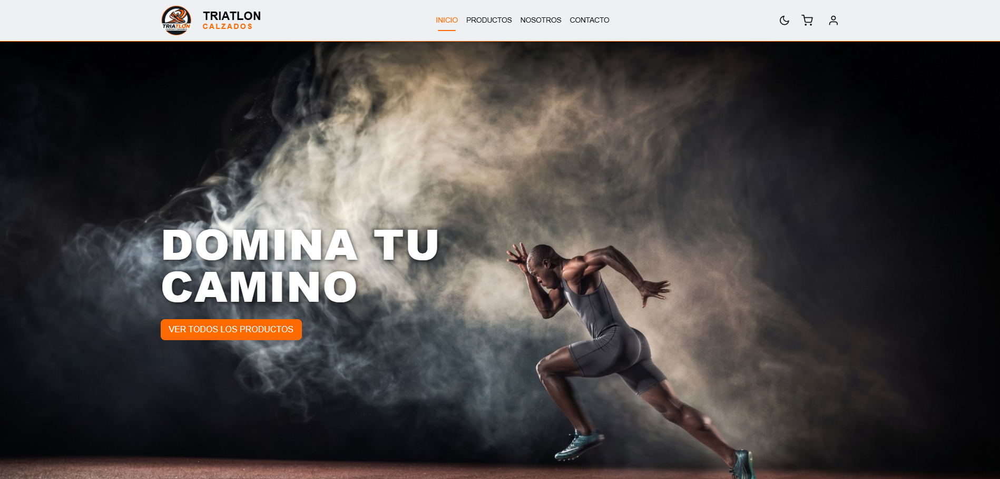
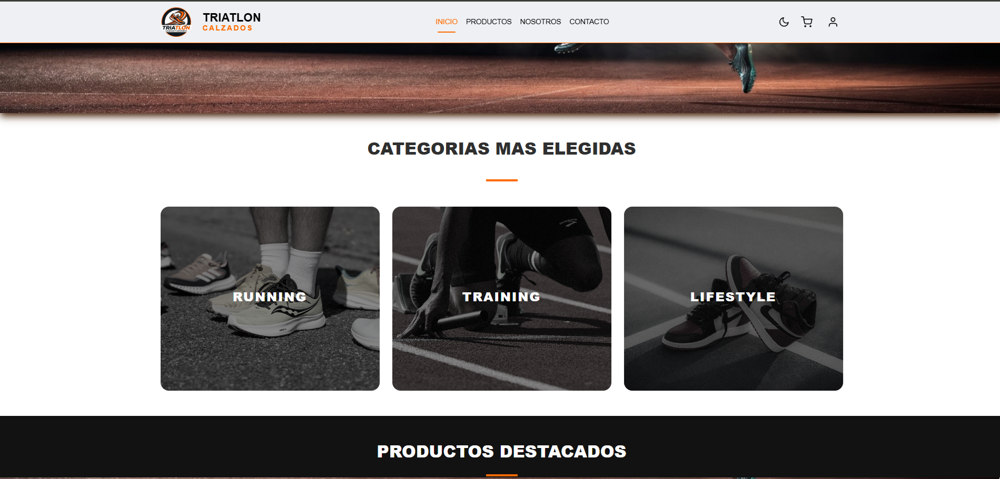
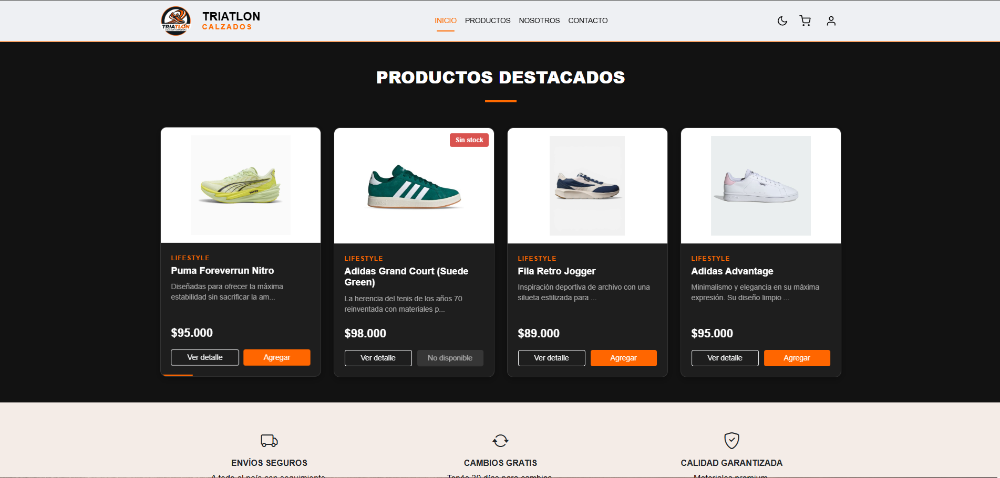

### Catálogo
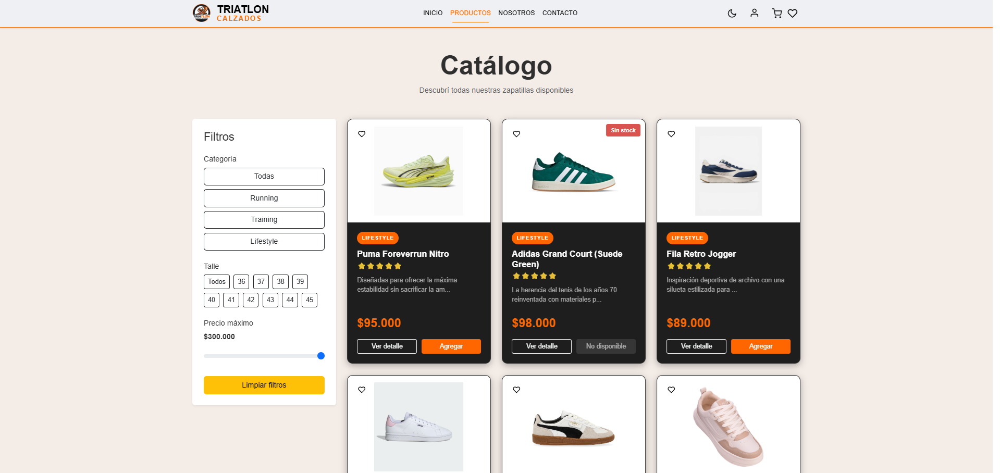

### Detalle de Producto
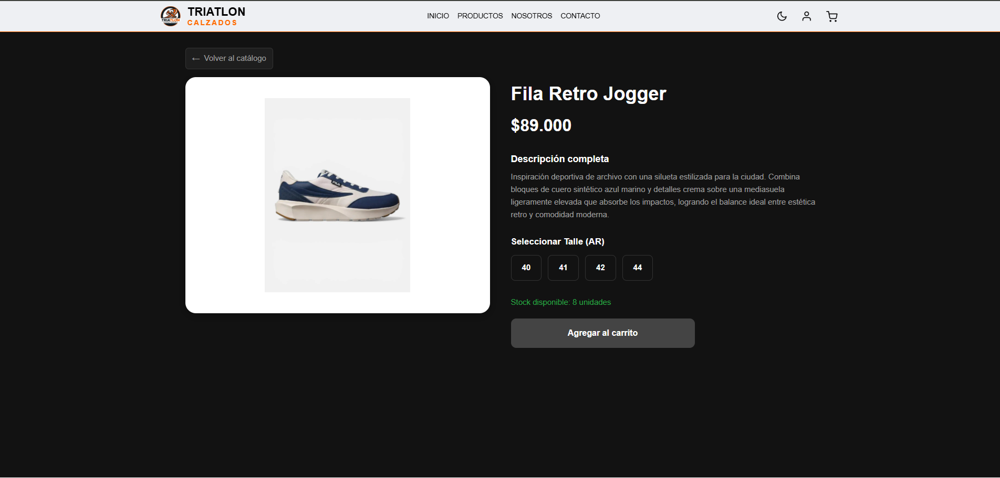
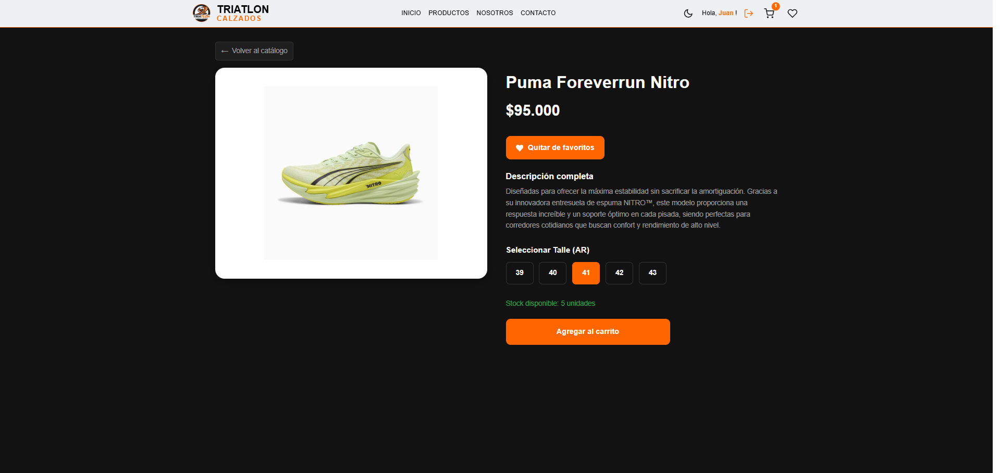

### Favoritos
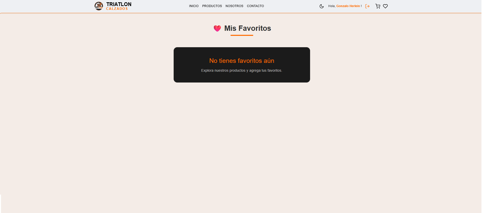
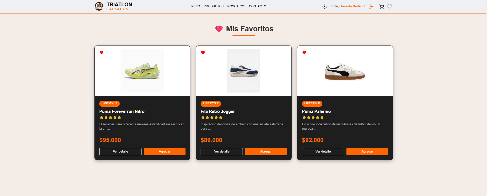

### Carrito
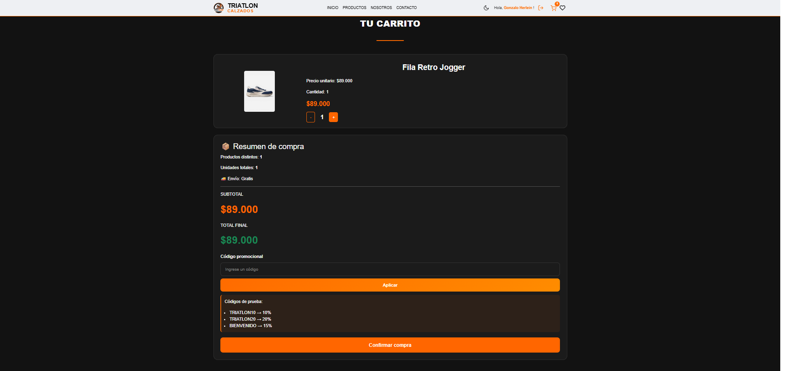

### Nosotros
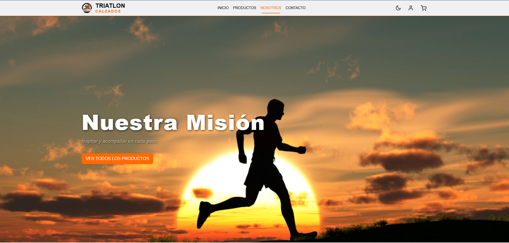
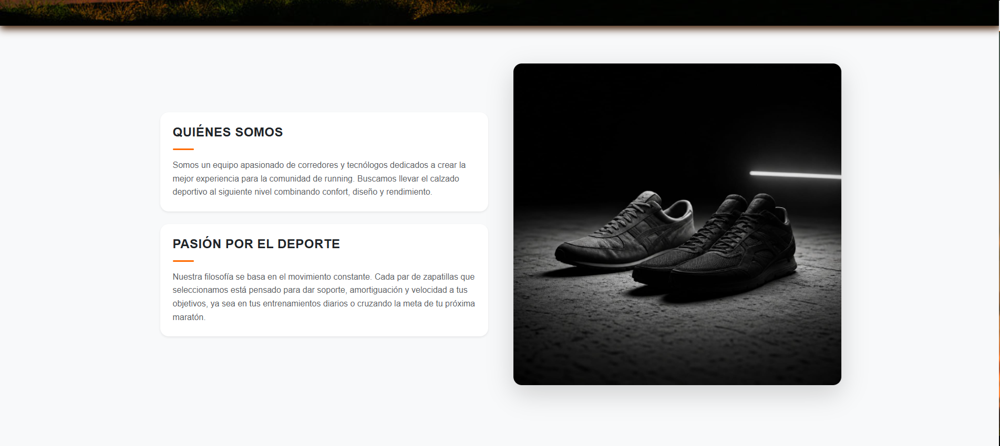

### Contacto
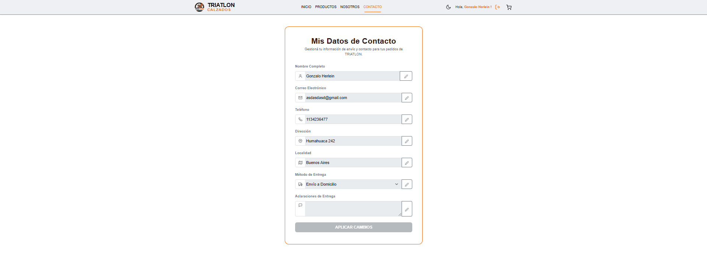

### Registro
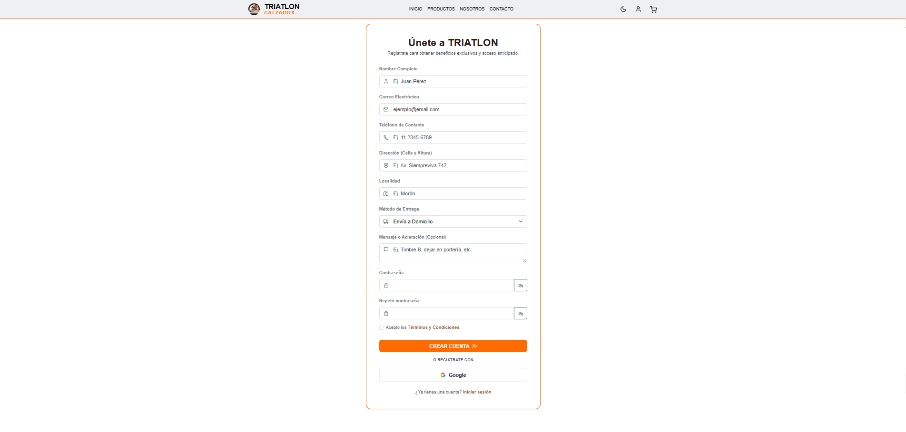

### Inicio de sesion 
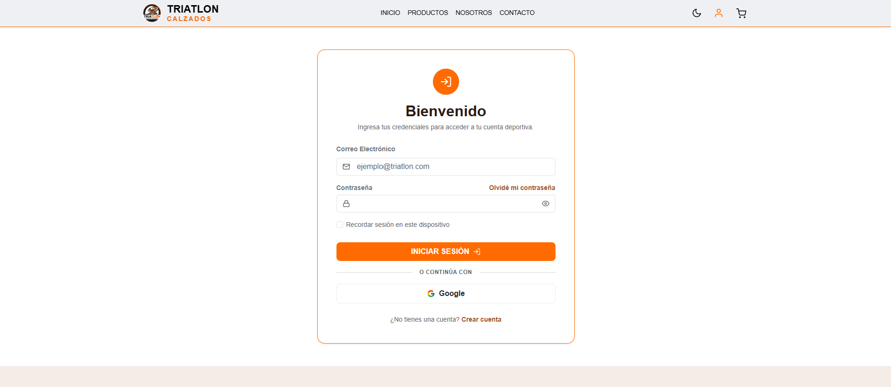


---

## 🌐 Deploy

Proyecto desplegado en:

**[Agregar URL del deploy aquí]**

---

## 📚 Trabajo Práctico

Materia: Construcción de Interfaces de Usuario (CIU)

Año: 2026

Universidad Nacional de Hurlingham (UNAHUR)
